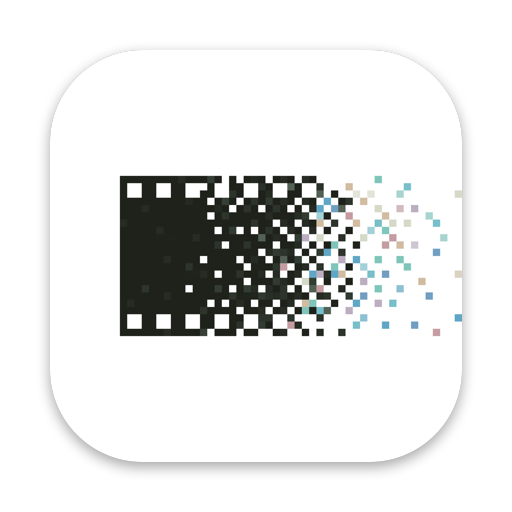

  

<h1 align="center">Positives</h1>

  <b>The free photo editor for Mac, inspired by analogue photography.</b> 
  A complete editor with a modern, intuitive design: real film looks, grain and light, for every photo you take.

  

Free · No account · No subscription · Works offline

<table align="center">
  <tr>
    <td align="center">
      
    </td>
    <td>
      <b>Also free: Negatives</b> 
      A simple tool that turns your film negatives into photos. 
      <a href="https://github.com/giaggito/Negatives-Positives/releases/latest/download/Negatives.dmg">Download Negatives</a>
    </td>
  </tr>
</table>

For Macs with Apple silicon (M1 or newer), macOS 14 or newer · Easiest download page: <a href="https://giaggito.github.io/Negatives-Positives/">giaggito.github.io/Negatives-Positives</a>

---

## How to install (2 minutes)

1. Click the **Download** button above. The file goes to your **Downloads** folder.
2. Open the downloaded file (**Positives.dmg** or **Negatives.dmg**). A small window appears.
3. **Drag the app icon onto the Applications folder** in that window.
4. Open **Applications** in the Finder and double-click the app.

### The first time you open it

The apps are free and made by one person, so they are not registered with Apple. The first time, your Mac
asks you to confirm that you want to open them. You only do this once:

1. Double-click the app. A message says Apple could not check it. Click **Done** (or **OK**).
2. Open **System Settings** (the grey gear icon in the Dock, or  menu → System Settings).
3. Click **Privacy & Security** on the left, then scroll down on the right.
4. Next to *"Positives was blocked…"* (or *Negatives*), click **Open Anyway**, then type your Mac password.
5. Click **Open**. From now on the app opens normally, like any other.

> On macOS 14 Sonoma you can also simply **right-click** the app → **Open** → **Open**.

---

## Positives

A complete photo editor that feels like the darkroom.

- **Film looks.** Kodak Portra, Gold, Ektar, Fuji, CineStill, Ilford, Tri-X and many more, with real film
  grain, halation and glow. Black &amp; white with colour filters, like on a lens.
- **Everything you need.** Light, colour, curves, colour grading, a colour mixer, Fujifilm-style Color Chrome,
  vignette.
- **Masks.** Brush, gradients, and automatic sky, subject and people selection.
- **Double exposures.** Lay up to three photos over each other, like two exposures on one negative.
- **Presets.** Save a film look or your whole edit and apply it to other photos in one click.
- **Your photos stay untouched.** Every edit can be undone, and the originals are never changed.
- **Opens RAW files from all major cameras**, plus JPEG, HEIC, PNG and TIFF. Exports JPEG, TIFF, PNG and HEIC
  at any size, with sharpening for screen or print.

## Negatives

Turn colour and black &amp; white negatives into positives, automatically.

- **Open a whole roll at once.** Drag a folder of negatives onto the window. Each frame is converted on its own,
  and the roll is balanced as a whole, the way a good lab prints it.
- **Any film, any scanner.** Photographed with a camera (RAW files from Fujifilm, Canon, Nikon, Sony, Panasonic,
  Olympus, Leica, Pentax, DNG and more) or scanned (JPEG, TIFF, PNG, HEIC).
- **Natural colours without fiddling.** The orange film mask is removed, greys stay grey, and each frame gets the
  right brightness.
- **Simple corrections when you want them.** Crop and straighten, rotate, a neutral picker, exposure, warmth and
  contrast, copy settings to the whole roll.
- **High-quality export** to JPEG or 16-bit TIFF.

---

## Questions or problems?

Open an [issue](https://github.com/giaggito/Negatives-Positives/issues): describe what happened and, if you
can, add a screenshot. Suggestions are welcome too.

## Licence

© 2026 Giacomo Ancora. Positives and Negatives are free software, licensed under the
[GNU General Public License, version 3](LICENSE): you may use, share and change them, and anything built from
them must stay open source under the same licence. They come with no warranty.

They build on LibRaw, libjpeg-turbo, the LLVM OpenMP runtime, film data and looks from spektrafilm, RawTherapee
and t3mujinpack, and a U²-Net sky model. See [THIRD_PARTY_NOTICES.md](THIRD_PARTY_NOTICES.md) and, in either app,
Help → Credits &amp; Licences. Film and brand names are trademarks of their owners and are used only to say which
film a look resembles.

For developers: how the apps work and how to build them is in [docs/TECHNICAL.md](docs/TECHNICAL.md).
